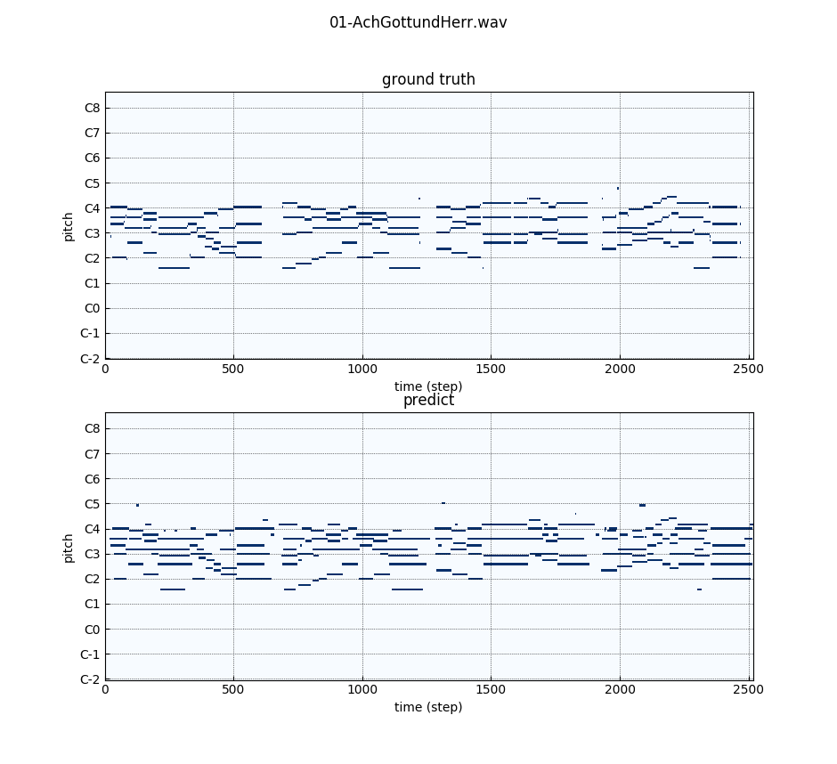

# multi-layered-cepstrum

Source code of the paper [Multi-Layered Cepstrum for Instantaneous Frequency Estimation]() accepted at GlobalSIP 2018.

## Requirements
* Numpy
* Scipy

For the bach10 example:
* Librosa (file IO)
* Matplotlib (visualization)
* Pypianoroll (visualization)

## Quick Start

1. Donwload [bach10](http://music.cs.northwestern.edu/data/Bach10.html) dataset.
2. Run with default parameters.
```
python bach10.py your/download/path/01-AchGottundHerr/01-AchGottundHerr.wav \
       --f0_file your/download/path/01-AchGottundHerr/01-AchGottundHerr-GTF0s.mat
.
.
.
Time cost: 5.6769 seconds
Precision: 0.7661, Recall: 0.9170, F-score:, 0.8348
```

